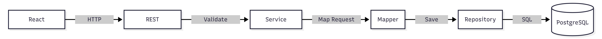
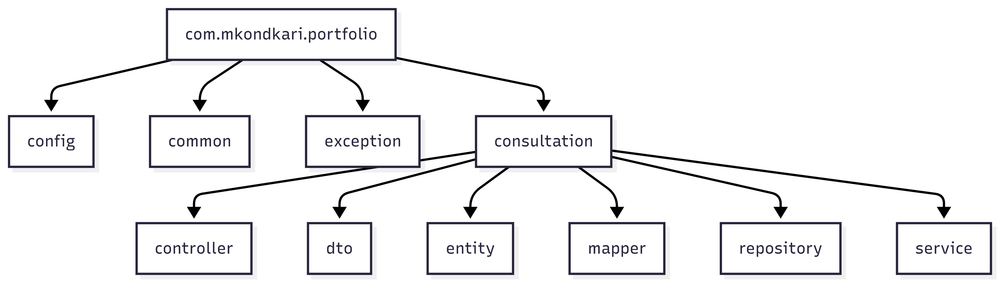
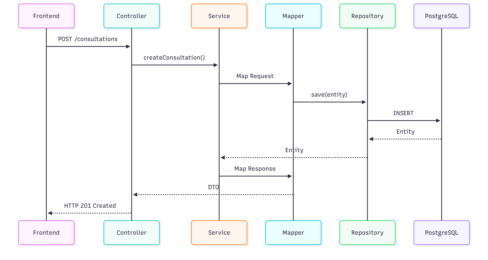
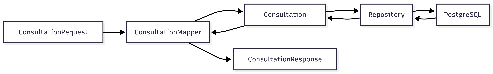
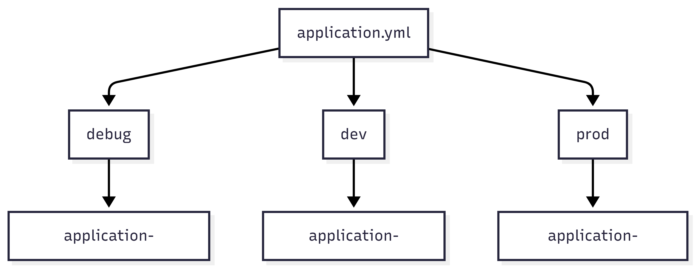

# 🏗️ Backend Architecture

> This document provides a detailed overview of the Portfolio Backend architecture, design principles, request lifecycle, package structure, coding standards, and future roadmap.

---

# 📑 Table of Contents

- Project Overview
- Design Principles
- Technology Stack
- Architecture Overview
- Project Structure
- Package Responsibilities
- Request Lifecycle
- Validation Flow
- Service Layer
- Repository Layer
- Mapper Layer
- Exception Handling
- Configuration
- Spring Profiles
- Database Integration
- API Documentation
- Logging Strategy
- Security
- Testing Strategy
- Coding Standards
- Future Roadmap

---

# 📌 Project Overview

The Portfolio Backend is built using **Spring Boot** following enterprise software engineering practices.

The backend exposes REST APIs that power the Portfolio Website and Consultation Platform while maintaining a clean, scalable, and maintainable architecture.

Current focus:

- Consultation Management

Future modules:

- Authentication
- Contact Management
- Portfolio CMS
- Admin Dashboard
- Email Notifications
- Analytics

---

# 🎯 Design Principles

The project follows the following principles:

- ✅ Clean Architecture
- ✅ Separation of Concerns
- ✅ SOLID Principles
- ✅ RESTful API Design
- ✅ DTO Pattern
- ✅ Layered Architecture
- ✅ Constructor Injection
- ✅ Centralized Exception Handling
- ✅ Database Versioning using Flyway
- ✅ Environment-Based Configuration

---

# 🛠 Technology Stack

| Technology  | Version |
|-------------|---------|
| Java        | 21      |
| Spring Boot | 4.x     |
| Maven       | Latest  |
| PostgreSQL  | 16      |
| Flyway      | Latest  |
| Docker      | Latest  |
| OpenAPI     | Latest  |
| MapStruct   | Latest  |
| Lombok      | Latest  |

---

# 🏗️ Architecture Overview

<p>
    
</p>

---

# 📂 Project Structure

<p>
    
</p>

---

# 📦 Package Responsibilities

## config

Contains application configuration.

Examples

- OpenAPI
- Clock
- JPA Auditing
- Application Properties

---

## consultation

Business module responsible for consultation management.

Contains

- Controller
- Service
- Repository
- Mapper
- DTO
- Entity

---

## exception

Contains centralized exception handling.

Examples

- GlobalExceptionHandler
- BusinessException
- ResourceNotFoundException
- ErrorResponse

---

## common

Contains reusable utilities and shared components.

---

# 🔄 Request Lifecycle

<p>
    
</p>

---

# 📥 Request Processing

1. Client sends HTTP request.
2. Controller receives request.
3. Bean Validation validates payload.
4. Service executes business logic.
5. Mapper converts DTO to Entity.
6. Repository persists entity.
7. Database stores data.
8. Response is mapped back to DTO.
9. Controller returns HTTP response.

---

# ✅ Validation Flow

Validation is performed using Jakarta Bean Validation.

Examples

- @NotBlank
- @Email
- @Pattern
- @Size
- @FutureOrPresent

Validation failures are handled by the Global Exception Handler.

---

# ⚙️ Service Layer

Responsibilities

- Business Logic
- Transaction Management
- Data Validation
- Mapping Coordination

Guidelines

- Thin Controllers
- Fat Services
- Constructor Injection
- Read-only transactions where applicable

---

# 🔄 Mapper Layer

MapStruct is used for object mapping.

<p>
    
</p>

Responsibilities

- DTO → Entity
- Entity → DTO

Benefits

- Compile-time mapping
- Type safety
- Reduced boilerplate

---

# 🗄 Repository Layer

Uses Spring Data JPA.

Responsibilities

- CRUD Operations
- Database Queries
- Pagination
- Sorting

---

# 🚨 Exception Handling

Centralized using:

```
GlobalExceptionHandler
```

Handles

- Validation Exceptions
- Business Exceptions
- Resource Not Found
- Unexpected Exceptions

Returns consistent API responses.

---

# ⚙️ Configuration

Configuration is environment-specific.

Files

```
application.yml
application-debug.yml
application-dev.yml
application-prod.yml
```

---

# 🌍 Spring Profiles

| Profile | Purpose                 |
|---------|-------------------------|
| debug   | Local Development       |
| dev     | Development Environment |
| prod    | Production              |

<p>
    
</p>
---

# 🗄 Database Integration

Database

- PostgreSQL

Migration Tool

- Flyway

Current Migration

```
V1__create_consultation_table.sql
```

---

# 📖 API Documentation

Swagger UI

```
/swagger-ui.html
```

OpenAPI JSON

```
/v3/api-docs
```

---

# 📝 Logging Strategy

Current

- Spring Boot Logging

Future

- Structured Logging
- Correlation IDs
- Request Logging
- Audit Logging

---

# 🔒 Security

Current

- Bean Validation
- Input Validation
- Exception Handling

Future

- JWT Authentication
- Authorization
- OAuth2
- CSRF Protection
- Rate Limiting

---

# 🧪 Testing Strategy

Future testing layers

- Unit Tests
- Integration Tests
- Repository Tests
- Controller Tests
- API Tests

---

# 📏 Coding Standards

The project follows:

- SOLID Principles
- Clean Code
- Constructor Injection
- DTO Pattern
- Layered Architecture
- REST Naming Standards
- Consistent Exception Handling
- Immutable DTOs where applicable

---

# 🚀 Future Roadmap

## Phase 1

- Authentication
- Authorization
- Contact Module

## Phase 2

- Admin Dashboard
- Portfolio Management
- File Upload

## Phase 3

- Redis
- Email Notifications
- Monitoring
- Metrics
- CI/CD Pipeline

[//]: # ()
[//]: # (---)

[//]: # ()
[//]: # (# 📚 Related Documentation)

[//]: # ()
[//]: # (- database.md)

[//]: # (- docker.md)

[//]: # (- api.md)

[//]: # (- deployment.md)

[//]: # (- security.md)

---

**Last Updated**

Sprint 23 – Backend Production Readiness