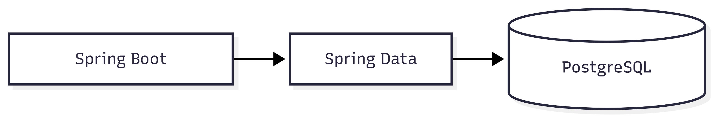
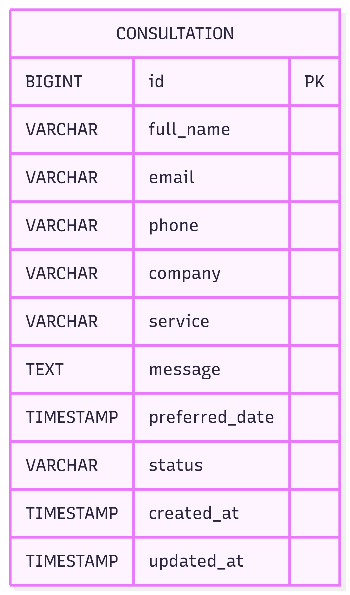
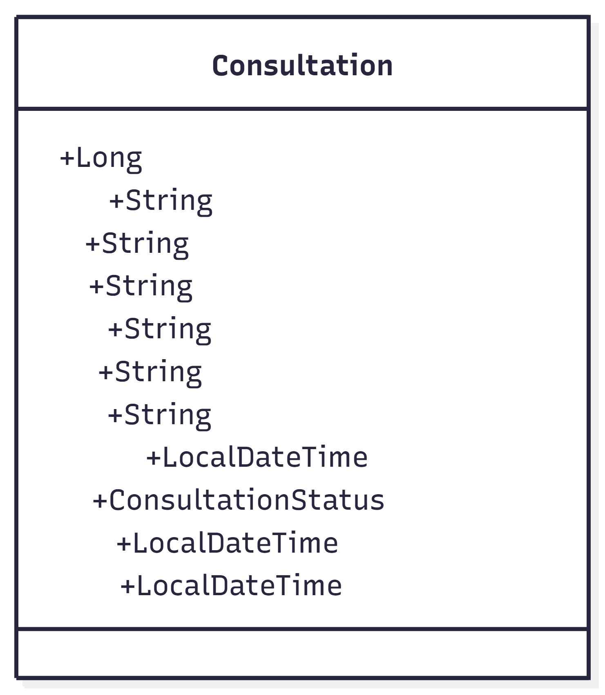
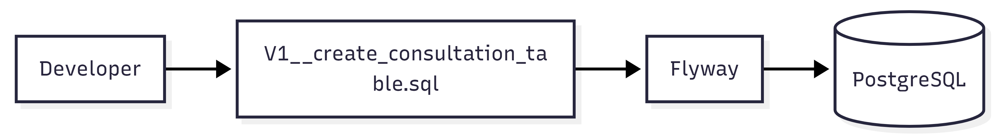

# 🗄️ Database Documentation

> This document describes the database architecture, schema design, migration strategy, naming conventions, indexing strategy, and future roadmap for the Portfolio Backend.

---

# 📑 Table of Contents

- Overview
- Database Technology
- Design Principles
- Database Architecture
- Current Schema
- Entity Relationship Diagram
- Consultation Table
- Table Relationships
- Index Strategy
- Audit Columns
- Flyway Migration
- Naming Conventions
- Performance Guidelines
- Security
- Backup Strategy
- Future Roadmap

---

# 📌 Overview

The Portfolio Backend uses **PostgreSQL** as the primary relational database.

Database schema changes are managed using **Flyway**, ensuring every environment remains synchronized through version-controlled SQL migrations.

Current Module

- Consultation Management

Future Modules

- Authentication
- Users
- Roles
- Portfolio
- Skills
- Experience
- Contact
- Blog
- Analytics

---

# 🛠 Database Technology

| Technology      | Version             |
|-----------------|---------------------|
| PostgreSQL      | 16                  |
| Flyway          | Latest              |
| Spring Data JPA | Latest              |
| Hibernate       | Spring Boot Managed |

---

# 🎯 Design Principles

The database follows enterprise design standards.

- ✅ Normalized Design
- ✅ Primary Keys
- ✅ Foreign Keys
- ✅ Indexed Search Columns
- ✅ Audit Columns
- ✅ Soft Migration Strategy
- ✅ Version Controlled Schema
- ✅ Performance Optimized

---

# 🏗️ Database Architecture

<p>
    
</p>

---

# 🗄 Current Schema

Current database contains a single module.

```
consultation
```

Future releases will introduce additional business domains.

---

# 📊 Entity Relationship Diagram

<p>
    
</p>

---

# 📋 Consultation Table

<p>
    
</p>

---

## Columns

| Column         | Type      | Nullable | Description            |
|----------------|-----------|----------|------------------------|
| id             | BIGINT    | No       | Primary Key            |
| full_name      | VARCHAR   | No       | Client Name            |
| email          | VARCHAR   | No       | Email Address          |
| phone          | VARCHAR   | No       | Phone Number           |
| company        | VARCHAR   | Yes      | Company Name           |
| service        | VARCHAR   | No       | Requested Service      |
| message        | TEXT      | No       | Consultation Message   |
| preferred_date | TIMESTAMP | Yes      | Preferred Meeting Date |
| status         | VARCHAR   | No       | Consultation Status    |
| created_at     | TIMESTAMP | No       | Record Creation Time   |
| updated_at     | TIMESTAMP | No       | Last Update Time       |

---

# 🔑 Primary Key Strategy

Current

```
BIGSERIAL
```

Primary Key

```
id
```

Future

- UUID Support (Optional)

---

# 🔗 Relationships

Current Release

No table relationships.

Future relationships will include:

```
User
│
├── Consultation
├── Contact
└── Portfolio
```

---

# 📈 Index Strategy

Current Indexes

| Index                       | Purpose       |
|-----------------------------|---------------|
| idx_consultation_status     | Status Search |
| idx_consultation_created_at | Sorting       |
| idx_consultation_email      | Email Lookup  |

Guidelines

- Index frequently searched columns.
- Avoid unnecessary indexes.
- Review index usage periodically.

---

# 🕒 Audit Columns

Every business table should contain:

| Column     | Purpose         |
|------------|-----------------|
| created_at | Record Creation |
| updated_at | Last Update     |

Future

- created_by
- updated_by

---

# 🔄 Flyway Migration

<p>
    
</p>

Current Migration

```
V1__create_consultation_table.sql
```

Migration Naming Convention

```
V1__description.sql

V2__description.sql

V3__description.sql
```

Rules

- Never modify executed migrations.
- Always create a new migration.
- Keep migrations idempotent where possible.
- One logical change per migration.

---

# 📝 Naming Conventions

## Tables

```
snake_case
```

Example

```
consultation
```

---

## Columns

```
snake_case
```

Example

```
created_at
updated_at
preferred_date
```

---

## Primary Keys

```
id
```

---

## Foreign Keys

```
<entity>_id
```

Example

```
user_id
portfolio_id
```

---

## Indexes

```
idx_<table>_<column>
```

Example

```
idx_consultation_status
```

---

# ⚡ Performance Guidelines

Recommendations

- Use indexes appropriately.
- Avoid SELECT *.
- Keep transactions short.
- Use pagination for large datasets.
- Optimize frequently executed queries.
- Review execution plans.

---

# 🔒 Database Security

Current

- Environment Variables
- Parameterized Queries
- Spring Data JPA

Future

- Database Encryption
- Secrets Management
- Read-only Users
- Connection Pool Monitoring

---

# 💾 Backup Strategy

Development

- Docker Volume

Production

- Daily Backup
- Point-in-Time Recovery
- Automated Restore Testing

---

# 🚀 Future Database Roadmap

## Phase 1

- Users
- Roles
- Authentication

## Phase 2

- Portfolio
- Skills
- Experience

## Phase 3

- Contact
- Blog
- Analytics

---

# 📚 Related Documentation

- backend.md
- docker.md
- deployment.md
- security.md

---

**Last Updated**

Sprint 23 – Backend Production Readiness