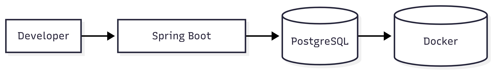
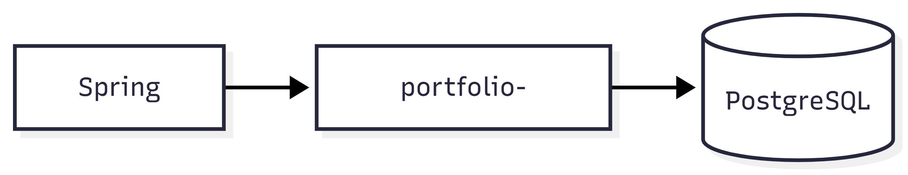

# 🐳 Docker Documentation

> This document describes the Docker architecture, container strategy, networking, volumes, and deployment approach used by the Portfolio project.

---

# 📑 Table of Contents

- Overview
- Why Docker?
- Current Architecture
- Docker Components
- Docker Compose
- Networks
- Volumes
- Container Lifecycle
- Running the Project
- Useful Commands
- Troubleshooting
- Best Practices
- Future Roadmap

---

# 📌 Overview

Docker provides a consistent development environment by containerizing infrastructure components.

Current Docker usage:

- PostgreSQL Database

Future Docker services:

- Spring Boot Backend
- Redis
- Nginx Reverse Proxy
- Monitoring Stack

---

# 🎯 Why Docker?

Benefits

- Consistent Environment
- Easy Setup
- Isolated Dependencies
- Reproducible Builds
- Portable Development
- Simplified Deployment

---

# 🏗 Docker Architecture



---

# 📦 Docker Components

## PostgreSQL

Purpose

- Stores application data

Image

```
postgres:16
```

Port

```
5432
```

---

## Docker Volume

Purpose

Persistent database storage.

Current Volume

```
portfolio_postgres_data
```

---

## Docker Network

Purpose

Container communication.

Current Network



```
portfolio-network
```

---

# 📄 Docker Compose

Current Services

| Service    | Status    |
|------------|-----------|
| PostgreSQL | ✅ Running |

Future Services

| Service     | Status  |
|-------------|---------|
| Spring Boot | Planned |
| Redis       | Planned |
| Nginx       | Planned |

---

# 📁 Project Structure

```text
backend/
docker-compose.yml
```

---

# 🔄 Container Lifecycle


---

# 🚀 Running the Project

## Start Containers

```bash
docker compose up -d
```

---

## Stop Containers

```bash
docker compose down
```

---

## Restart Containers

```bash
docker compose restart
```

---

## View Running Containers

```bash
docker ps
```

---

## View Logs

```bash
docker compose logs
```

---

## Remove Containers

```bash
docker compose down -v
```

---

# 💾 Volumes

Current Volume

```
portfolio_postgres_data
```

Purpose

- Persistent Database Storage

---

# 🌐 Networks

Current Network

```
portfolio-network
```

Purpose

- Secure communication between containers.

---

# 📝 Useful Docker Commands

Build Images

```bash
docker compose build
```

Start

```bash
docker compose up -d
```

Stop

```bash
docker compose down
```

View Logs

```bash
docker compose logs -f
```

Inspect Volume

```bash
docker volume ls
```

Inspect Network

```bash
docker network ls
```

---

# ⚠ Troubleshooting

Common Issues

- Docker Desktop not running
- WSL not started
- Port 5432 already in use
- Volume conflicts
- Database authentication failures

---

# ✅ Best Practices

- Pin Docker image versions
- Use named volumes
- Use environment variables
- Never commit secrets
- Keep containers stateless
- Use health checks
- Use restart policies

---

# 🚀 Future Roadmap

Phase 1

- PostgreSQL

Phase 2

- Spring Boot Container

Phase 3

- Redis

Phase 4

- Nginx

Phase 5

- Monitoring Stack

---

# 📚 Related Documentation

- backend.md
- database.md
- deployment.md

---

**Last Updated**

Sprint 23 – Backend Production Readiness